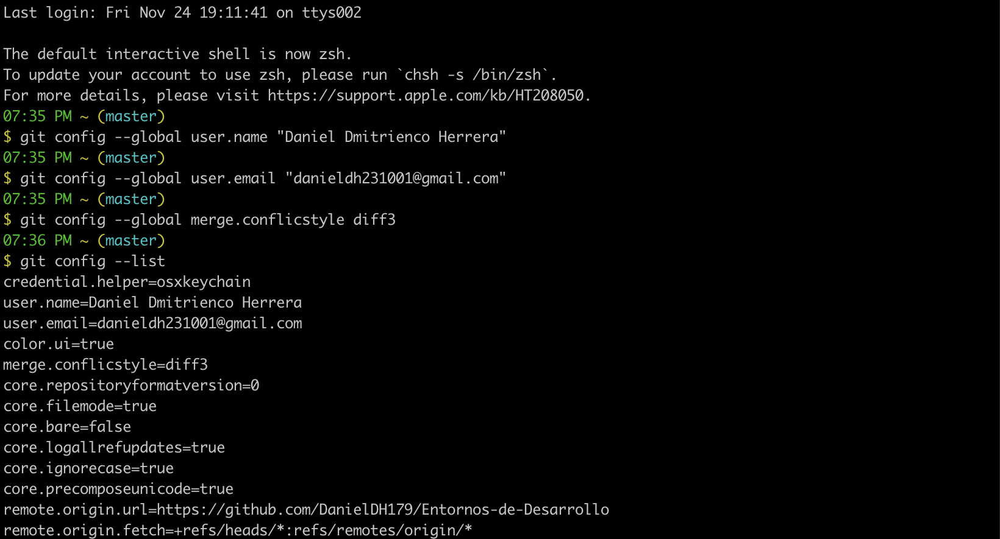
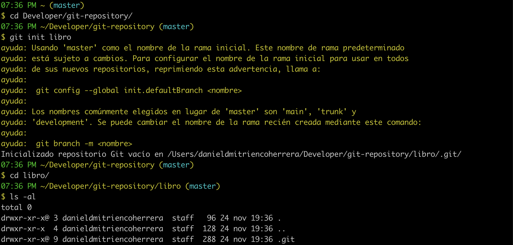
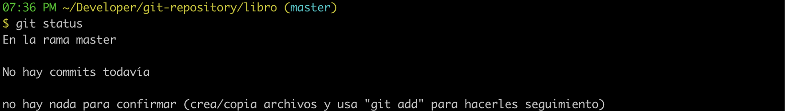
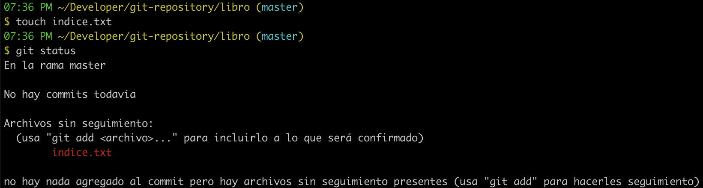
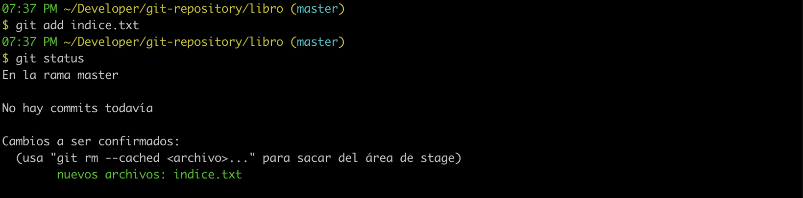
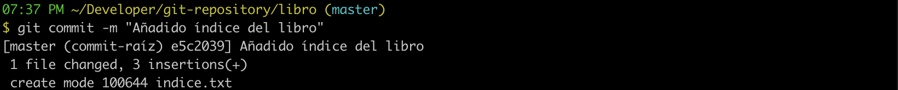
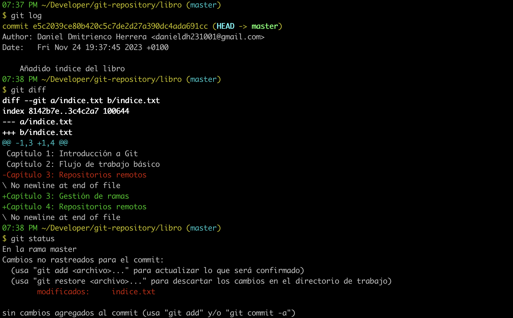
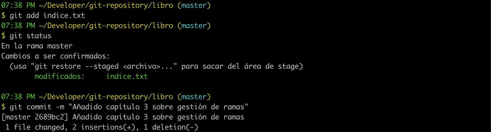
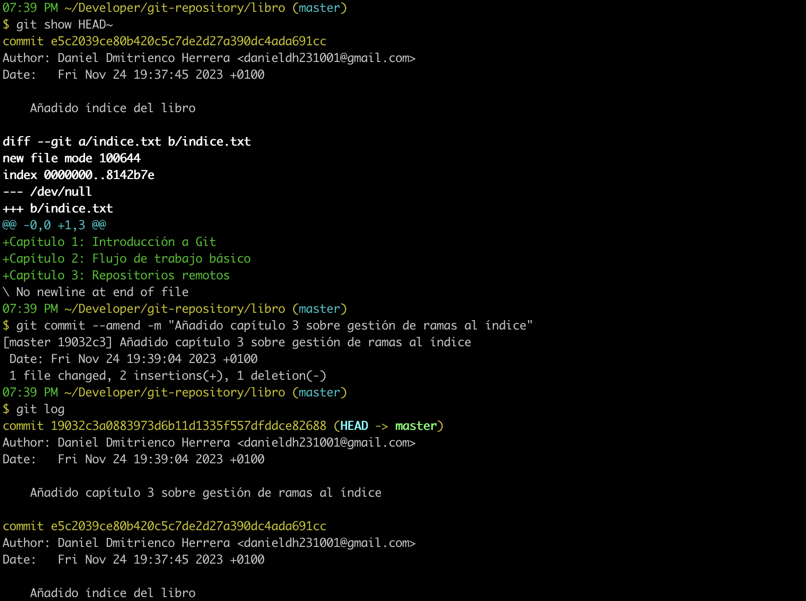

# Creación y actualización de repositorios

## Descripción

**Configurar Git** definiendo el nombre del usuario, el correo electrónico y activar el coloreado de la salida. Mostrar la configuración final.

Crear un repositorio nuevo con el nombre `libro` y mostrar su contenido.

Comprobar el estado del repositorio. Crear un fichero `indice.txt` con el siguiente contenido:

```
Capítulo 1: Introducción a Git
Capítulo 2: Flujo de trabajo básico
Capítulo 3: Repositorios remotos
```

Comprobar de nuevo el estado del repositorio. Añadir el fichero a la zona de **intercambio temporal**. Volver a comprobar una vez más el estado del repositorio.

**Realizar un commit** de los últimos cambios con el mensaje `"Añadido índice del libro"` y ver el estado del repositorio.

Cambiar el fichero `indice.txt` para que contenga lo siguiente:

```
Capítulo 1: Introducción a Git
Capítulo 2: Flujo de trabajo básico
Capítulo 3: Gestión de ramas
Capítulo 4: Repositorios remotos
```

Mostrar los cambios con respecto a la última versión guardada en el repositorio. Hacer un commit de los cambios con el mensaje `"Añadido capítulo 3 sobre gestión de ramas"`.

Mostrar los cambios de la última versión del repositorio con respecto a la anterior. Cambiar el mensaje del último commit por `"Añadido capítulo 3 sobre gestión de ramas al índice"`. Volver a mostrar los últimos cambios del repositorio.

## Sistema operativo

* macOS Ventura 13.6.1

## Paso a paso

Antes de nada necesitamos instalar Git y su correspondiente bash, ya que el sistema operativo no tiene esto último:

```bash
brew install git
git config --global color.ui true
brew install bash-completion
```

A continuación abrimos una nueva terminal y ejecutamos:

```bash
open -e ~/.bash_profile
```

Se nos abrirá un documento oculto llamado `bash_profile` al cual le añadiremos estas líneas:

```bash
if [ -f $(brew --prefix)/etc/bash_completion ]; then
  . $(brew --prefix)/etc/bash_completion
fi
source $(brew --prefix)/etc/bash_completion.d/git-prompt.sh
PS1="\[\033[32m\]\@ \[\033[33m\]\w\$(__git_ps1 \" (\[\033[36m\]%s\[\033[33m\])\") \n\$\[\033[0m\] "
```

Guardamos y abrimos nuevamente la terminal. Ya tenemos el coloreado de la salida.

### Ejercicio 1

Primero definimos nuestros datos de usuario y mostramos la configuración final:

<!-- git config --global user.name "Daniel Dmitrienco Herrera"
git config --global user.email "danieldh231001@gmail.com"
git config --global merge.conflictstyle diff3
git config --list -->


### Ejercicio 2

Nos dirigimos a la ruta `~/Developer/git-repository` y creamos el repositorio `libro`, luego mostramos su contenido:

<!-- cd Developer/git-repository/
git init libro
cd libro/
ls -al -->


### Ejercicio 3

Una vez creado el repositorio anterior, comprobamos su estado:

<!-- git status -->


Ahora creamos un fichero llamado `indice.txt` con el contenido descrito en la [descripción](#descripción). Para ello, podemos usar en la terminal:

```bash
touch indice.txt
```

Una vez generado y rellenado, vemos el estado del repositorio otra vez:

<!-- git status -->


Añadimos el fichero a la zona de intercambio temporal, y comprobamos una vez más su estado:

<!-- git add indice.txt
git status -->


### Ejercicio 4

Realizamos un commit con el mensaje correspondiente y comprobamos el estado del repositorio;

<!-- git commit -m "Añadido índice del libro" -->


### Ejercicio 5

Editamos el fichero `indice.txt` y mostramos los cambios con respecto a la versión anteriormente salvada:

<!-- git log
git diff
git status -->


Finalmente, hacemos otro commmit de los cambios:

<!-- git add indice.txt
git status
git commit -m "Añadido capítulo 3 sobre gestión de ramas" -->


### Ejercicio 6

De nuevo, imprimimos los cambios de la última versión y cambiamos el mensaje del commit. Terminamos volviendo a mostrar los cambios del repositorio:

<!-- git show HEAD~
git commit --amend -m "Añadido capítulo 3 sobre gestión de ramas al índice"
git log -->


## Referencias

* [How to create a text file in a folder](https://apple.stackexchange.com/questions/84309/how-to-create-a-text-file-in-a-folder)