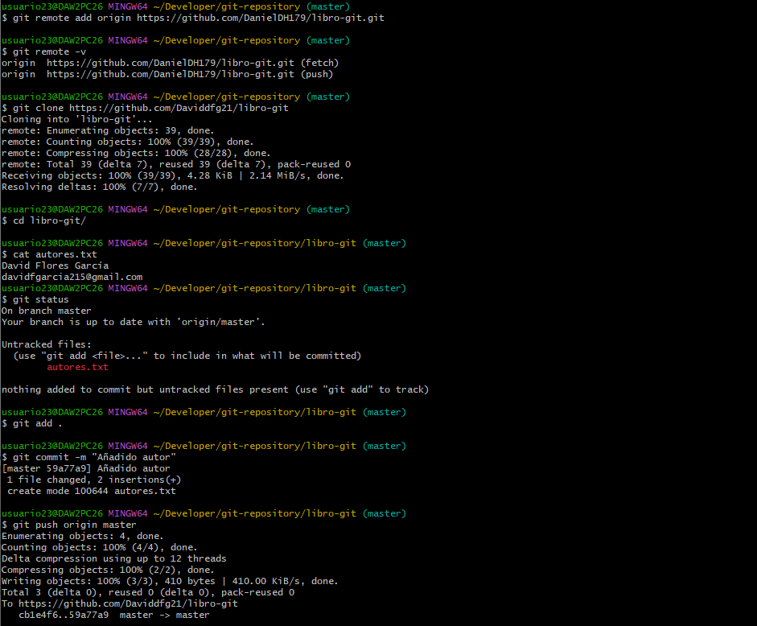
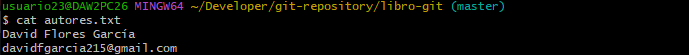
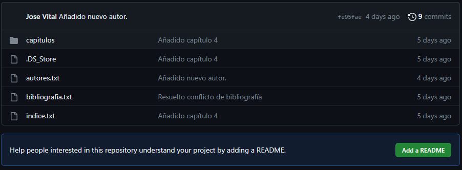
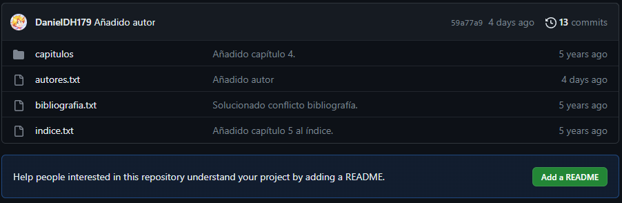

# Repositorios remotos

## Sistema operativo

* Windows 10 Pro Education

## Paso a paso

### Ejercicio 1

[Repositorio libro-git](https://github.com/DanielDH179/libro-git)

### Ejercicio 2

### Ejercicio 3

### Ejercicio 4

No se permite el acceso hasta que se permita un `pull request` del repositorio `fjdelgadoleal/Entornos_Desarrollo/`.